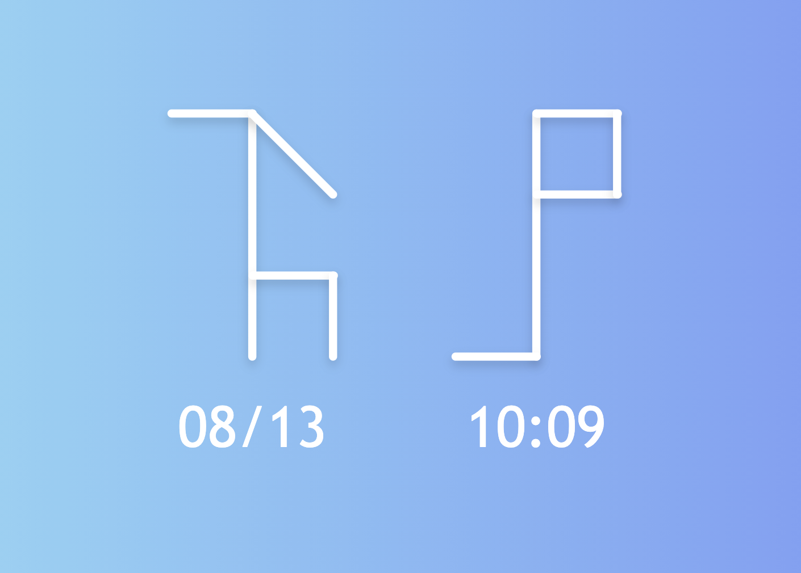

# Cistercian Clock

As part of a fascinating bit of history, [Cistercian Numerals](https://en.wikipedia.org/wiki/Cistercian_numerals) were used by monks in medieval times to record 4 digit numbers.

Once you know the pattern they are easy to read and make for cool looking graphics. So I decided as a proof of concept to make a clock that renders them. 

<a href="https://kyle-west.github.io/cistercian-clock">
See the clock in action here
<br/>
<br/>

</a>

<br/><br/>

## `wc-cistercian`

To better encapsulate the SVG rendering, I made a Web Component which is easy to consume

```html
<wc-cistercian value="1234"></wc-cistercian>
```

I thought about making this consumable by other people... but I have my doubts that anyone would be interested. If you wish to use either the web component or svg or other part of this repo, please [submit an issue here](https://github.com/kyle-west/cistercian-clock/issues/new?title=Please%20Make%20This%20Shared&body=I%20would%20like%20to%20use%20the%20Web%20Component%20as%20a%20(bower%20|%20node)%20package.%20%3Cinsert%20reason%20why%20here%3E).

<br/><br/>

## Contact

Feel free to [start a discussion](https://github.com/kyle-west/cistercian-clock/discussions) or reach out to me on Twitter [@KyleWestCS](https://twitter.com/KyleWestCS).
